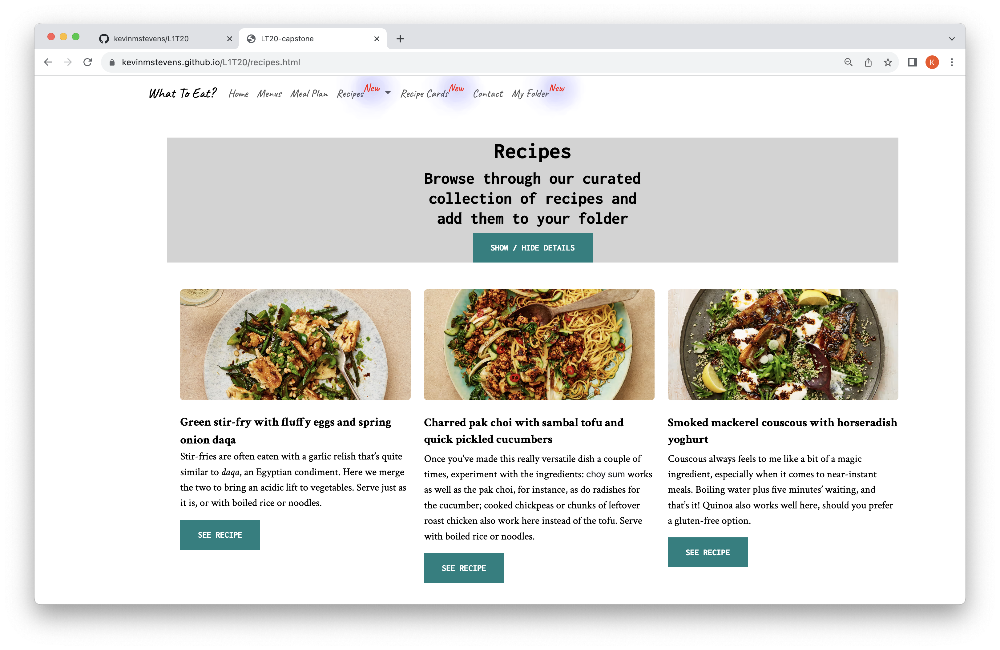

# Project Title: My first website

## Description of project: This is my first attempt at designing a website with some functionality.
<br>The importance of this project is around this being an opportunity to develop my skills and receive feedback.
<br>What does this project do? The website is for an imagery service which organises your menu planning.

## Description

A simple website for an imaginary business which makes menu recommendations

## Table of contents

The table of contents is automatically generated [click here for instructions](https://docs.github.com/en/repositories/managing-your-repositorys-settings-and-features/customizing-your-repository/about-readmes)

>For the rendered view of any Markdown file in a repository, including README files, GitHub will automatically generate a table of contents based on section headings. You can view the table of contents for a README file by clicking the  menu icon at the top left of the rendered page.

## Getting Started

### Dependencies

* none

### Installing

* How/where to download your program
* Any modifications needed to be made to files/folders

### Executing program

* How to run the program
* Step-by-step bullets
```
code blocks for commands
```

### Screenshots





## Help

Any advise for common problems or issues.
```
command to run if program contains helper info
```

## Authors

Contributors names and contact info

ex. Kevin Stevens
ex. kevin.65536@gmail.com

## Version History

* 0.2
    * 
* 0.1
    * Initial Release

## License

This project is licensed under the [NAME HERE] License - see the LICENSE.md file for details

## Acknowledgments

Inspiration, code snippets, etc.
